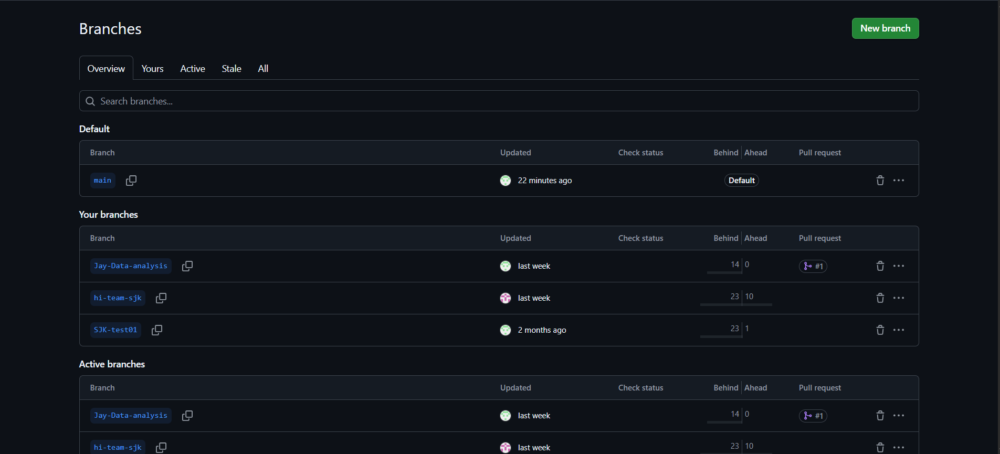
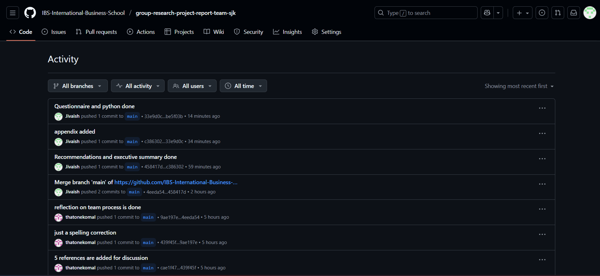
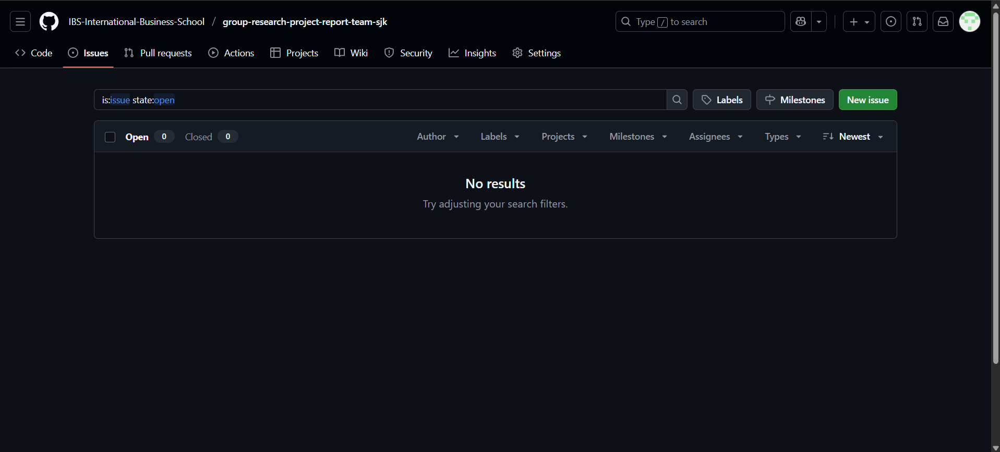

# Group Research Project Report

## Team Members:
1. SAM
2. KOMAL 
3. JAY
4. ... 

## Declaration
[ChatGPT 5.0] was used to [brainstorm themes and structure] for this group research project report on [topic]. Prompt: '...' No AI-generated text is included in the final submission. Accessed: [Date]. Available at: https://chat.openai.com/.

We have retained a complete set of raw data, including questionnaires (papers completed by hand or record downloaded from the online survey platform), recordings, and/or transcripts of interviews, secondary data, etc., as well as data analysis files and documents. 

## Github Repository link
The complete project repository including codes, documentation, images, and collaboration evidence is available at:
https://github.com/IBS-International-Business-School/group-research-project-report-team-sjk 

---
## Executive Summary

This report examines the attitudes and behavious of GenX and GenZ towards sustainable packaging. The study focuses on 4 core concepts namely Environment values, Eco-friendly packaging preferences, willingness to pay, and trust in sustainability claims. A survey was carried out with 56 people and the results from Gen X and Gen Z were compared using statistical tests. The findings show that Gen X has stronger environmental values and feels more responsible for protecting the environment. Gen X is also more willing to pay extra for eco-friendly products, while Gen Z is more careful about spending. Both groups prefer eco-friendly packaging, and both are concerned about greenwashing, although Gen X is more sceptical. Based on the outcome, companies must provide genuine information on their products, print labels, and provide various prices to ensure that both generations may afford as well as need a product that is suitable to them.

---

## Introduction
The research question for this study is “How do gen z and gen x’ environmental values, perceived credibility of sustainability claims, and packaging design preferences influence their willingness to pay for sustainably packaged products?”. This research question will make a comparison between the attitudes of two wo generational groups Generation Z (1997-2012) and Generation X (1965-1980) on sustainable packaging. Based on four major components like environmental values which will help us figure out how each generation feels about protecting their environment, reducing waste, supporting eco-friendly products, business who support sustainable packaging. Secondly, we will be looking at willingness to pay which will explore how much extra money each generation is willing to pay for sustainable resources, biodegradable and recyclable packaging thirdly we will explore trust in sustainability claims how much a generation relies upon a business or a product if they have green, eco-friendly or sustainable packaging. And lastly packing design preference, which explains which feature of sustainable packing appeals most to the customer. Our main objective to do survey research is because we're looking into attitudes, preferences and perceptions of people and we can’t perceive these feelings directly, so we need to know their honest opinions on how they feel about sustainable packaging in terms of value, money and trust. So, to know their opinions we have constructed a questionnaire which will help us give a clear picture of how they feel about these three components, and help us quantify their feelings and to make a fair comparison between generation Z and generation X. 

...

## Methodology

This research will have a cross-sectional survey to compare the attitudes of Gen Z and Gen X attitudes toward sustainable packaging. This survey is made on google form with 23 questions regarding environmental values, willingness to pay, packaging design preferences, and perceived credibility of sustainability claims. To measure these variables, we have selected Likert-scale questions with five response which are Strongly Disagree, Disagree, Not Sure, Agree, and Strongly Agree and one open ended question for their personal opinions. The target population consists of consumers from Gen Z (born in1997–2012) and Gen X (born in 1965–1980), the form was circulated through different social media platforms like Facebook, Instagram, WhatsApp groups, LinkedIn. The sampling technique that we have used is stratified sampling because we're working on subgroups of a population like Gen Z and Gen X. 
We have in total collected 56 responses for this survey research. To analysis our data we needed to clean it for which we have used python collab. We uploaded the data and removed all the null values, we changed all the Likert scale options into numeric form, used the count code to assess what the number count was for our demographics section. Our population is divided into Gen Z and Gen X, but python also gave us a Gen Y which means people born between (1981 – 1996). But we had to filter it out because we didn’t need it. So, after data cleaning we were left with 11 Gen X AND 27 Gen Z. Then we did statistical analysis that included descriptive statistics, independent samples t -test to compare the generations and then data was analyzed in excel. 

---

### Results
A survey was conducted with 56 people among three age groups: Gen-X, Gen-Y, and Gen-Z. The research question focuses only on Gen X and Gen Z so i have excluded the responses of Gen Y in the data analysis process. Overall, 11 responses were from Gen-X, 18 from Gen-Y and 27 from Gen-Z. The questionnaire was prepared on 4 core concepts: Environment values, Eco-friendly packaging preferences, willingness to pay, and trust in sustainability claims. Prepared overall and individual descriptive statistics summary, sample T-tests were conduscted on 18 questions to learn whether the generation difference existed. The result shows that both the generations behave differently in some scenarios and at some point their attitudes were similar.
 
## Environmental Values:

.png>)

This chart illustrates how strong both the generation values environmental sustainability. Gen-X steadily scores higher than Gen-Z in terms of environmental values. 

Both the differences are statistically significant: 

1. Environmental priority (p = 0.04)
2. Personal responsibility (p = 0.04)

The p-value is less than the alpha value (0.05), which means that there is only 4% probability that the differnces between both the generation happened by luck. This means that Gen-X plays crucial role when it comes to protecting the environment and feels personal responsibility towards sustainability products. 

It proves that Gen-X has higher scores than Gen-Z, both the generations agree that the companies should take responsibility and reduce waste to protect environment. The statistical difference states that Gen-X shows strong environmental values and deeper personal commitment.

## Eco-friendly products and packaging:

This charts depicts how both the generations prefer eco-friendly products and packaging indicating high mean scores. 
The first bar chart (Left) states that Gen-X prefer eco-friendly products even if their prices are high with mean values 4.18 for Gen-x and 3.41 for Gen-z. Since the p value is 0.03 which is less than the alpha value, it means that Gen-X are more willing to pay for the eco-friendly products even at a higher price. 

The second bar chart (Right) shows the levk of preference for eco-friendly packaging over conventional. There is no significant difference found in t-test over packaging and the preference for sustainability packaging stays high in both the groups.

Gen-Z values sustainability and have personal commitment but are price sensitive.

## Willingness to pay extra:

This figure states that both generations show moderate willingness to pay 10% extra on products for eco-packaging. The mean scores are quite similar so the difference is low but Gen-X reports slightly high. 

The p-value is 0.74 which is higher than the 0.05 threshold, so no significant difference. Both the generations have similar attitude towards paying more for the packaging. This means that when a slight fee is charged both the generations shows more level of acceptance in paying extra for the packaging. 

## Trust, Greenwashing & Scepticism:

This bar chart compares the viewpoints of both  generations about the company's sustainability claims, and greenwashing. Gen-X shows high interest in scepticism because brands exxagerate environmental benefits and companies claim to be eco-friendly just to attract customers. This means that Gen-X is more of at risk in company's message about sustainability. On the contrary, 

Gen-Z shows more trust in company's claims than Gen-x with means scores of 3.41 & 2.55 respectively. Both the generations have hypothetical impression while coming to trusting the company's claim about sustainability.

Out of the 3 questions there is only one significant value with difference between generations. "companies pretend to be eco-friendly to attract customers" - P = 0.03, since the pvalue is less than alpha 0.05, the difference is statistically significant. 
Gen Z is more likely than Gen X to believe company's false claims. Both generations have higher sceptism towards company pretending to be sustainable.  

---

## Discussion
The findings on environmental values and purchasing behaviors of Generation Z (Gen Z) and Generation X (Gen X) have given us a very vital perspective on how we need to market our sustainably packaged products. The questions related to environmental values and responsibilities showed significant intergenerational differences and, in this relationship, Gen X was leading as compared to Gen Z (Pinho, 2024). To sum up there is an overall increased acceptance of eco-friendly packaging across both generations, which shows that if EcoPack introduces sustainable design packages it will for sure be favorable. However, when it comes to willingness to pay for sustainably packaged products, we thought that gen z would be more willing to sustainability packaged goods based on the recent studies (Gomes, 2023).  However, through our survey answer we came to know that Gen X is significantly more willing to choose eco-friendly products even at a higher price as compared to Gen Z because the economy that we are living in where financial instability is on a rise, gen z’s are struggling to pay more for sustainability packages product . Ecopack’s marketers need to understand that they should introduce and focus more on their Gen X consumers but also keeping in mind that they do have limited purchasing power however their packaging strategies should focus affordability and more suitable pricing options like tax credit and discounts (Elgammal, 2024). If we talk about credibility, Greenwashing and Trust both generations show high skepticism, strongly agreeing that companies often exaggerate sustainability claims (greenwashing). This usually happens because businesses are not often clear about their product, packaging, ingredients where they are sourced from and often make big claims which when proven they are not true. So, businesses need to be transparent and be sure about their claims to build their customers trust (Mohammad, 2025). Through our survey we concluded that Gen X is more skeptical about companies pretending to be eco-friendly because they have experienced a vast amount of marketing trends about greenwashing and sustainability so now, they think that business often exaggerates rather than providing accurate facts and figures. For further implication we as Ecopack data analyst would come up with a streamlined marketing strategy for both generation which includes that for Gen X the sustainability packaging should have strong transparent moral values with evidences also properly show casing how everything sourced and making a difference and for Gen Z the pricing strategies need to be revised in form of premiums, discounts and student programs. Moreover, the regulatory bodies also need to enforce strict rules and regulations, focus on sustainability goals and certifications so that the overall system is moving smoothly (Nichols, 2023). 

----

## Recommendations

Based on the results, companies should work on providing legitimate information about the sustainable packaging. To reduce greenwashing concerns, government approved certifications/label printed on the package, simple explainations with real proof would build confidence, particularly to Gen-X with greater doubt. 

While Gen-X is willing to pay more than Gen-Z, company should have 2 products one affordable and sustainable product for GenZ and premium for GenX would allow both the generations to choose products as per their budget. Companies should manufacture products which would be easily recycled with minimal packaging. Social media and other messaging tools are the best way to reach out to people for spreading awareness, sharing values as a social responsibility.

----

## Reflection on Team Process
... 
Over these past weeks, me and my group members have put in collective efforts to best of our abilities to perform all the given tasks and this report. We have used github and visual studio to share all the relevant material, make all the changes and additions, and to compile this entire project. The team work was done by dividing the entire report in small chunks, everyone was working individually but we were helping each other at any given moment. The weekly work was discussed through stand ups where we use to discuss that what is done, what needs to be done further, if their are any issues or problems regarding any part of the report. We started off by selecting a research topic and came to a unique research question. We made a survey questionnaire and upon we kept on making alot of changing to it until we were fully satisfied with it. Upon approval of our instructor we started spreading it and started getting data. And then we all started doing our designated parts according to our skill set. Working on github was challanging as a beginner, but because of this collective effort we were able to use branches for our personal work,we made sure our tasks where stages, commit and pushed and pulled. We were also working side by side on github to make sure that everything was seamless and visible. Overall, the team process was great because if anyone was lacking in a certain skill set, other person was kind enough to help them through. 

## References and Appendices

Elgammal, I. G. M. a. A.-M. O., 2024. Sustainable Purchasing Behaviors in Generation Z: The Role of Social Identity and Behavioral Intentions in the Saudi Context.. Sustainability, 16(11), p.4478..
Gomes, S. L. J. a. N. S., 2023. Willingness to pay more for green products: A critical challenge for Gen Z.. Journal of Cleaner Production, 390, p.136092..
Mohammad, A. J. Z. a. S. A., 2025. Understanding The Impact of Green Marketing on Green Consumer Purchase Intention: A Systematic.. Asian Journal of Social Science and Management Technology.
Nichols, B. a. H. J. 2., 2023. A comparison of sustainability attitudes and intentions across generations and gender: a perspective from US consumers.. Cuadernos de Gestión, 23(1), pp.51-62..
Pinho, M. a. G. S., 2024. Environmental sustainability from a generational lens—A study comparing generation X, Y, and Z ecological commitment.. Business and Society Review, 129(3), pp.349-372..

# Questionnaire:
A Comparative Study of Gen Z and Gen X Attitudes Toward Sustainable Packaging

Demographics  
Demographics

1. What is your gender? *

Female
Male
Prefer not to say

2. Which year are you born in? *

3. Approximate monthly personal income in forints? *

under 250,000
250,000 – 400,000
400,000 – 600,000
600,000 and above

4. Employment status? *

Full-time employment
Part-time employment
Retired
Unemployed

Environmental Values

Protecting the environment should be prioritized. *
Strongly Disagree / Disagree / Not sure / Agree / Strongly Agree

I consider it my personal responsibility to reduce waste. *
Strongly Disagree / Disagree / Not sure / Agree / Strongly Agree

What factors influence your decision to buy eco-friendly products? *

Companies hold the responsibility to minimize the environmental impact of their products. *
Strongly Disagree / Disagree / Not sure / Agree / Strongly Agree

I prefer to purchase products that are environmentally friendly, even if they come at a higher price. *
Strongly Disagree / Disagree / Not sure / Agree / Strongly Agree

I prefer products with eco-friendly packaging over conventional packaging. *
Strongly Disagree / Disagree / Not sure / Agree / Strongly Agree

I worry about how today’s packaging waste will affect future generations. *
Strongly Disagree / Disagree / Not sure / Agree / Strongly Agree

I actively seek information regarding the sustainability of the products I purchase. *
Strongly Disagree / Disagree / Not sure / Agree / Strongly Agree

I trust in a company's claims regarding the environmental benefits of its packaging. *
Strongly Disagree / Disagree / Not sure / Agree / Strongly Agree

Brands often exaggerate the environmental benefits of their products. *
Strongly Disagree / Disagree / Not sure / Agree / Strongly Agree

I often find it challenging to determine which brands truly practice sustainability. *
Strongly Disagree / Disagree / Not sure / Agree / Strongly Agree

I would be willing to change my purchasing habits based on new information about a product's environmental impact. *
Strongly Disagree / Disagree / Not sure / Agree / Strongly Agree

Imagine your usual bread costs 400 forints. If that same bread cost 460 forints, would you be willing to pay an additional 10% for eco-friendly packaging? *
Strongly Disagree / Disagree / Not sure / Agree / Strongly Agree

I would pick a more expensive product with eco-friendly packaging instead of a cheaper one with regular packaging. *
Strongly Disagree / Disagree / Not sure / Agree / Strongly Agree

I think companies should use sustainable packaging, even if their products cost more. *
Strongly Disagree / Disagree / Not sure / Agree / Strongly Agree

I am cautious about trusting sustainability claims made by brands. *
Strongly Disagree / Disagree / Not sure / Agree / Strongly Agree

I worry that some companies pretend to be eco-friendly just to attract customers. *
Strongly Disagree / Disagree / Not sure / Agree / Strongly Agree

I think there should be stricter rules to stop companies from making false environmental claims. *
Strongly Disagree / Disagree / Not sure / Agree / Strongly Agree

I get frustrated when brands use “green” words without proving their products are truly sustainable. *
Strongly Disagree / Disagree / Not sure / Agree / Strongly Agree

## Python Code Snippets

from IPython.core.interactiveshell import InteractiveShell
InteractiveShell.ast_node_interactivity = "all"

from google.colab import files
uploaded = files.upload()

import pandas as pd
df = pd.read_excel('A Comparative Study of Gen Z and Gen X Attitudes Toward Sustainable Packaging  (Responses).xlsx')
df.info()
df.head()

df.info()

df.isnull().sum()

df['What is your gender?'].value_counts()
df['Which year are you born in?'].value_counts()
df['Approximate monthly personal income in forints?'].value_counts()
df['  Employment status?  '].value_counts()

def gen_group(year):
  try:
    year = int(float(year))
  except:
    return 'other'
  if 1997 <= year <= 2012:
    return 'Gen Z (1997 - 2012)'
  elif 1965 <= year <= 1980:
    return 'Gen X (1965 - 1980)'
  else:
    return 'Gen Y (1981 - 1996)'
df['Generation'] = df['Which year are you born in?'].apply (gen_group)
df['Generation'].value_counts()

df_gxz = df[df['Generation'].isin(['Gen X (1965 - 1980)', 'Gen Z (1997 - 2012)'])]
df_gxz['Generation'].value_counts()

likert_map = { 'Strongly Disagree': 1, 'Disagree' : 2, 'Not sure': 3, 'Agree': 4, 'Strongly Agree': 5}
df_numeric = df_gxz.replace(likert_map)
df_numeric.head()
df_numeric.dtypes

df_numeric.to_excel("GenX_GenZ_data.xlsx", index=False)
from google.colab import files
files.download("GenX_GenZ_data.xlsx")

## Github Evidences

### Branching workflow
 

### Pull request

### Commit

### Issue tracking
